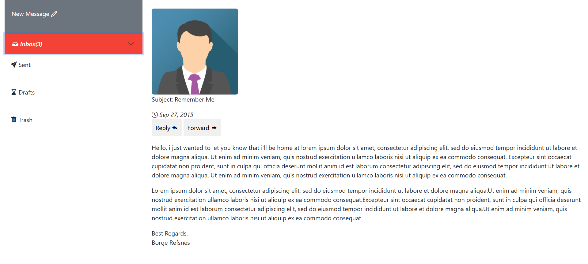
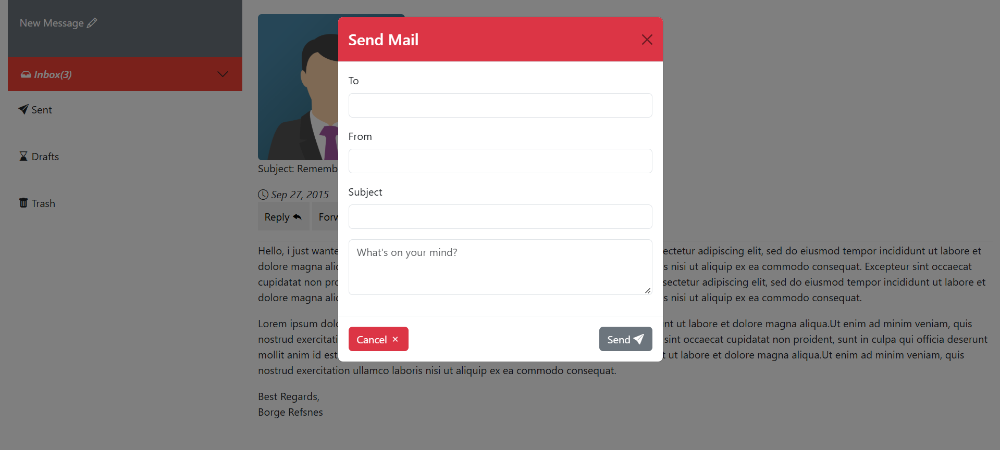
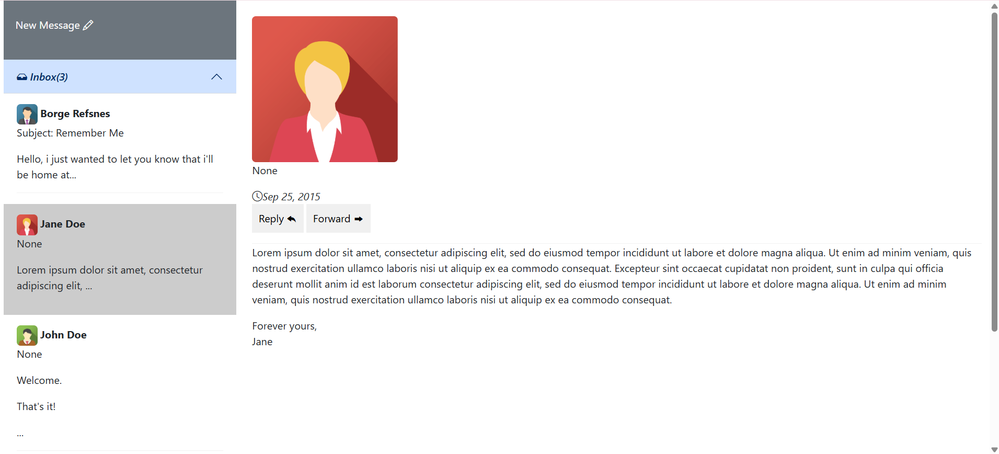

**About the Project**

In this project, I tried to create a **Gmail-inspired email interface** for displaying and managing received messages.

I used **HTML** for the structure, **CSS** for most of the styling, and **Sass** to keep the CSS code more organized. I also used **JavaScript** to add more interactivity to the interface and make the project more dynamic.

